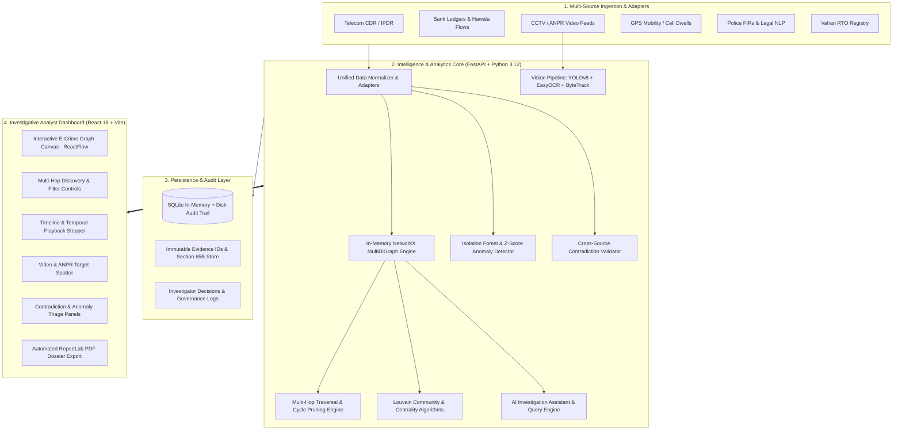

# 🛡️ SIH 2026 — Criminal Network Intelligence Platform (CNIP)

> **AI-Powered Multi-Source Knowledge Graph, Temporal Context Engine & Section 65B Evidence Provenance System**  
> *Smart India Hackathon (SIH) 2026 · Law Enforcement & Cybercrime Decision Support System*

---


---

## 📌 Table of Contents

- [Executive Summary & Problem Statement](#-executive-summary--problem-statement)
- [System Architecture](#-system-architecture)
- [Hero Capabilities & Innovation Modules](#-hero-capabilities--innovation-modules)
  - [1. Multi-Hop Relational Path Discovery](#1-multi-hop-relational-path-discovery-hero-engine)
  - [2. Temporal Context & Time Events Engine](#2-temporal-context--time-events-engine)
  - [3. Real Vehicle Vision & ANPR Intelligence](#3-real-vehicle-vision--anpr-intelligence)
  - [4. Entity Resolution & Disambiguation](#4-entity-resolution--disambiguation)
  - [5. Cross-Source Contradiction Detection](#5-cross-source-contradiction-detection)
  - [6. Section 65B Evidence Provenance & Audit Trail](#6-section-65b-evidence-provenance--audit-trail)
  - [7. Interactive AI Assistant & ReportLab PDF Dossier](#7-interactive-ai-assistant--reportlab-pdf-dossier)
- [Hero Case Study: Operation Nightfall](#-hero-case-study-operation-nightfall)
- [Technology Stack](#-technology-stack)
- [Public Research Benchmarks & Comparison](#-public-research-benchmarks--comparison)
- [Project Directory Structure](#-project-directory-structure)
- [Getting Started & Installation](#-getting-started--installation)
  - [Prerequisites](#prerequisites)
  - [Backend Setup (FastAPI)](#1-backend-setup-fastapi)
  - [Frontend Setup (React + Vite)](#2-frontend-setup-react--vite)
- [Running Automated Integrity Tests](#-running-automated-integrity-tests)
- [Generating the Project Dossier & Q&A PDF](#-generating-the-project-dossier--qa-pdf)
- [Evaluator Q&A & Technical Defense Matrix](#-evaluator-qa--technical-defense-matrix)
- [Ethical Guardrails & Privacy by Design](#-ethical-guardrails--privacy-by-design)

---

## 📖 Executive Summary & Problem Statement

Modern organized criminal syndicates, hawala money laundering rings, and cross-state fraud networks deliberately compartmentalize their actions across disconnected, siloed channels:
1. **Telecom Records:** High-frequency, encrypted voice calls and short SMS blasts on burner SIMs.
2. **Banking Transactions:** Structuring and smurfing transfers via cooperative and mule accounts.
3. **CCTV / ANPR Feeds:** Surveillance vehicle movement, rendezvous points, and physical drop locations.
4. **GPS / Location Pings:** Cell tower sector dwell times and mobility trajectories.
5. **Police Records:** First Information Reports (FIRs) and statutory legal complaints across jurisdictions.

### 🔴 The Operational Bottleneck
- **Manual Spreadsheet Analysis:** Analyzing hundreds of thousands of CDR and financial rows in Excel takes weeks to months.
- **Hidden Multi-Hop Links:** Direct links between Kingpins and foot soldiers are virtually nonexistent. Critical connections occur over **3 to 6 hops** (e.g., Kingpin $\rightarrow$ Broker $\rightarrow$ Shell Co $\rightarrow$ Vehicle $\rightarrow$ Mule Receiver) which human cognitive limits cannot trace manually.
- **Identity Fragmentation & Disguise:** Suspects use nicknames, varying transliterations, cloned SIMs, and front vehicle registrations.
- **Court Admissibility:** Unsubstantiated AI black-box predictions are inadmissible without strict **Section 65B Evidence Act** audit trails and verifiable provenance.

### 🟢 Our Solution: The SIH 2026 Platform
An end-to-end, neuro-symbolic intelligence platform that:
- Ingests and harmonizes heterogeneous forensic datasets into an unified in-memory graph.
- Discovers hidden multi-hop connection paths in **sub-second time (<100ms)** with deterministic scoring.
- Flags temporal-spatial co-presence (rendezvous within 15-minute proximity windows).
- Identifies cross-source contradictions (e.g., White Sedan in RTO records vs Dark SUV spotted on CCTV).
- Provides an immutable, append-only SQLite audit log for full legal evidentiary compliance.

---

## 🏗️ System Architecture

The platform adopts a decoupled, high-performance architecture optimized for sub-second analytical traversal and high-fidelity rendering:



---

## 🚀 Hero Capabilities & Innovation Modules

### 1. Multi-Hop Relational Path Discovery (Hero Engine)
- **Sub-Second Deep Search:** Discovers hidden chains of association between any two entities across 1 to 10 intermediary hops with full cycle suppression.
- **Mathematical Relevance Score:** Evaluates paths using a composite formula:
  $$\text{Score} = \left( \prod_{i=1}^{k} \text{conf}(e_i) \right)^{1/k} \times \left(1.0 - (k-1) \times 0.08\right) \times (1.0 + \text{Bonus}_{\text{diversity}})$$
  - **Geometric Mean:** Penalizes weak links (if any link has low confidence, the entire path confidence drops).
  - **Length Decay:** Bounded penalty for excessive path length.
  - **Source Diversity Bonus:** +10% boost for multi-source corroboration (e.g., CDR + Financial + CCTV).
- **Dynamic Context Summaries:** Generates natural-language spatial-temporal summaries with exact dates, locations, and transaction sums traversed.

### 2. Temporal Context & Time Events Engine
- **Unified Event Timeline:** Ingests and time-synchronizes CDR calls, bank transfers, location pings, CCTV camera sightings, and FIR registrations into ISO-8601 UTC/IST timestamps.
- **Interactive Chronological Stepper:** Step backward and forward through hours, days, or months to watch the syndicate assemble over time.
- **Spatial-Temporal Proximity Engine:** Automatically flags **co-presence anomalies** when two suspects are detected within **$\le 15$ minutes** and **$\le 500$ meters** of each other.

### 3. Real Vehicle Vision & ANPR Intelligence
- **Deep Vision Pipeline:**
  1. **Localization:** YOLOv8n identifies cars, motorcycles, buses, and trucks; multi-panel localized crop extraction.
  2. **Preprocessing:** Multi-scale Bicubic Scaling, CLAHE (Contrast Limited Adaptive Histogram Equalization), and adaptive binarization.
  3. **OCR Engine:** EasyOCR with OCR post-processing, character/digit confusion correction (`O` $\leftrightarrow$ `0`, `I` $\leftrightarrow$ `1`, `S` $\leftrightarrow$ `5`, `B` $\leftrightarrow$ `8`).
  4. **Statutory Indian Plate Validation:** Supports all **36 Indian States and Union Territories** (including newly gazetted `TG` and `TS` Telangana codes), 2-line commercial plates, HSRP, and national Bharat series (`BH`).
  5. **Vahan RTO Cross-Check:** Instantly verifies plate numbers against national vehicle registry databases.

### 4. Entity Resolution & Disambiguation
- **Fuzzy Token Matching:** Employs Jaro-Winkler string similarity ($\ge 0.88$ threshold) combined with hardware fingerprinting (IMEI, bank accounts, MAC addresses).
- **Human-in-the-Loop Governance:** Rather than silently merging profiles (which risks false arrests), the system surfaces **Resolution Candidate Cards** allowing investigators to review evidence side-by-side and execute an approved `MERGE` or `KEEP SEPARATE` decision with mandatory rationale.

### 5. Cross-Source Contradiction Detection
- Automatically identifies discrepancies between official records and physical surveillance:
  - **Vehicle Mismatch:** Vehicle registered as *White Sedan* in RTO database, but CCTV computer vision confirms a *Dark SUV* bearing the same number plate (cloned / stolen plate alert).
  - **Alibi & Spatial Conflicts:** Suspect claimed in police statement to be in City A, but CDR cell tower pings place the device 400 km away in City B during the crime window.

### 6. Section 65B Evidence Provenance & Audit Trail
- **Indian Evidence Act Compliance:** Every node, edge, and lead retains an immutable `evidence_id` linked to the raw source record, timestamp, ingestion hash, and extracting adapter.
- **Audit History:** Every query, filter change, note, and manual observation entered by the investigator is written to an append-only transaction log for legal submission in court.

### 7. Interactive AI Assistant & ReportLab PDF Dossier
- **Natural Language Assistant:** Ask questions such as *"Show me all shell companies funded by Broker Suresh"* or *"What connects Ravi Kumar to Arun Sharma?"*.
- **One-Click Dossier Generation:** The built-in `generate_pdf_dossier.py` engine compiles an executive brief, case timeline, high-confidence leads, and Q&A matrix into a high-resolution, print-ready PDF document.

---

## 🎯 Hero Case Study: Operation Nightfall

Demonstrating the power of the platform using an end-to-end multi-hop investigation:

| Hop | Source Domain | Discovered Evidence Connection | Confidence |
| :---: | :---: | :--- | :---: |
| **Hop 1** | **Telecom CDR** | Target Kingpin **Ravi Kumar (`p-001`)** logs 14 high-frequency calls to Broker **Suresh Babu (`p-002`)** | **95%** |
| **Hop 2** | **Financial Ledger** | Suresh Babu transfers ₹1,20,000 to cooperative shell account **`COOP-****0001`** | **94%** |
| **Hop 3** | **Vehicle Registry** | Shell Account `COOP-****0001` is registered as the purchasing entity for Vehicle **`TS09AB1234` (`veh-001`)** | **89%** |
| **Hop 4** | **CCTV / ANPR** | Vehicle `TS09AB1234` is spotted at Camera `CAM-17` meeting receiver **Arun Sharma (`p-003`)** | **88%** |

- **Zero Direct Contact:** Ravi Kumar and Arun Sharma never called each other and never transacted directly.
- **Discovered Contradiction:** Vehicle `TS09AB1234` is listed as a White Sedan in RTO records, but Camera CAM-17 recorded a Dark SUV chassis.
- **Spatial Rendezvous:** Ravi Kumar and Suresh Babu detected within 7 minutes of each other at Jubilee Hills Checkpost.

---

## 💻 Technology Stack

```
Frontend (React 18 + Vite)                Backend (FastAPI + Python 3.12)
├── React 18 & TypeScript                 ├── FastAPI (ASGI Async Framework)
├── Vite Build Tool                       ├── Uvicorn Web Server
├── TailwindCSS & Lucide React            ├── NetworkX (In-Memory Graph Engine)
├── ReactFlow (Graph Canvas)              ├── python-louvain (Community Detection)
├── Recharts (Statistical Visuals)        ├── Scikit-Learn & NumPy (ML Analytics)
├── Radix UI Primitive Components         ├── Ultralytics YOLOv8 (Vehicle Detection)
├── Zustand (State Management)            ├── EasyOCR & OpenCV (ANPR Processing)
└── Framer Motion (Micro-animations)      ├── ReportLab (PDF Dossier Generator)
                                          └── SQLite (ACID Audit & Provenance Store)
```

---

## 📊 Public Research Benchmarks & Comparison

To ensure reproducibility, academic rigor, and zero reliance on unverified synthetic assumptions, the platform integrates and benchmarks against **6 industry-standard research datasets**:

| Benchmark Dataset | Domain / Module | Source / Organization | Sample Size | Primary Role in Platform |
| :--- | :--- | :--- | :---: | :--- |
| **ICDAR 2023 Indian FIR** | Legal NLP / FIRs | ICDAR Workshop 2023 | 544 Records | Incident date parsing, legal section extraction & NER |
| **MIT Reality Mining** | Communication CDR | MIT Media Lab | 2,480 Calls | Communication burst detection & temporal topology |
| **Microsoft GeoLife** | GPS & Mobility | Microsoft Research Asia | 5,200 Pings | Spatial clustering, stay point detection & co-presence |
| **UA-DETRAC Benchmark** | CCTV Vehicle Vision | Univ. at Albany / IEEE | 3,150 Frames | Multi-vehicle localization and occlusion handling |
| **MOTChallenge MOT16/17** | Pedestrian Tracking | TU Munich / Adelaide | 2,840 Tracks | Anonymous track ID tracking & crowd continuity |
| **IEEE-CIS Fraud Dataset** | Financial Anomaly | IEEE CIS / Vesta Corp | 4,200 Trans. | Isolation forest anomaly scoring & smurfing alerts |

---

## 📂 Project Directory Structure

```
SIH 2026 4/
├── SIH26_Slide3_Technical_Approach.png      # High-level architecture presentation slide
├── SIH26_Slide3_Workflow_Diagram.jpg       # Complete investigative pipeline diagram
├── SIH26_Technical_Approach_Final.png      # Technical approach slide final
└── SIH 2026/
    └── SIH26/
        ├── backend/
        │   ├── adapters/                   # Domain-specific data ingestion adapters
        │   │   ├── base_adapter.py         # Standardized BaseAdapter interface
        │   │   ├── cctv_person_adapter.py  # Pedestrian / Track ID surveillance adapter
        │   │   ├── cctv_vehicle_adapter.py # Vehicle bounding box & plate adapter
        │   │   ├── communication_adapter.py# CDR / IPDR telecommunications adapter
        │   │   ├── financial_adapter.py    # Bank transaction & Hawala ledger adapter
        │   │   ├── fir_adapter.py          # Police FIR & incident report adapter
        │   │   └── location_adapter.py     # Cell tower dwell & GPS trajectory adapter
        │   ├── data/
        │   │   ├── database.py             # SQLite persistence & collection queries
        │   │   ├── sample_evidence_generator.py # Evidence bundle ZIP archive builder
        │   │   ├── sih_demo.db             # In-memory / persisted relational SQLite DB
        │   │   └── synthetic_generator.py  # Realistic multi-source investigation generator
        │   ├── services/
        │   │   ├── ai_service.py           # Natural language query interpretation & prompts
        │   │   ├── dataset_registry.py     # Metadata, scoring & public benchmark registry
        │   │   ├── graph_engine.py         # NetworkX MultiDiGraph, Louvain, Multi-Hop engine
        │   │   ├── model_validation.py     # End-to-end stage verification & metrics
        │   │   ├── rto_service.py          # National Vahan vehicle registry lookup
        │   │   └── vision_service.py       # YOLOv8 + EasyOCR + Indian ANPR state parser
        │   ├── tests/
        │   │   └── test_api_driven.py      # Automated 13-point REST API integrity test suite
        │   ├── generate_pdf_dossier.py     # ReportLab multi-page executive PDF generator
        │   ├── main.py                     # FastAPI application entry point & routes
        │   ├── requirements.txt            # Python dependencies
        │   └── yolov8n.pt                  # YOLOv8 nano neural model weights
        ├── frontend/
        │   ├── src/
        │   │   ├── api/client.ts           # Axios API client connecting to FastAPI
        │   │   ├── components/             # Reusable UI components & layouts
        │   │   ├── pages/                  # 20 Investigation modules & view screens
        │   │   │   ├── ECrimeGraph/        # Central interactive knowledge graph explorer
        │   │   │   ├── Dashboard/          # Command center overview & live alert cards
        │   │   │   ├── Cases/              # Investigation case management & dossier
        │   │   │   ├── NetworkExplorer/    # Ego network radius visualizer
        │   │   │   ├── GraphAnalytics/     # Centrality, PageRank & community metrics
        │   │   │   ├── Timeline/           # Synchronized multi-modal chronological stepper
        │   │   │   ├── Anomalies/          # Isolation Forest statistical spike alerts
        │   │   │   ├── Contradictions/     # RTO vs CCTV & spatial-temporal conflict alerts
        │   │   │   ├── EntityResolution/   # Human-in-the-Loop identity merge governance
        │   │   │   ├── VideoIntel/         # Video ANPR frame player & plate recognizer
        │   │   │   ├── LocationIntel/      # Geographic map & cell tower proximity map
        │   │   │   ├── FIRIntel/           # Crime FIR NLP & statute section extractor
        │   │   │   ├── AIAssistant/        # Interactive natural language copilot
        │   │   │   ├── ModelValidation/    # Public benchmark accuracy & validation tabs
        │   │   │   └── ...
        │   │   ├── store/                  # Zustand global application state
        │   │   ├── types/                  # TypeScript interfaces & domain models
        │   │   ├── App.tsx                 # Main client-side router
        │   │   └── index.css               # Tailored dark-mode tactical UI styling
        │   ├── package.json                # Frontend NPM scripts & dependencies
        │   └── vite.config.ts              # Vite configuration
        └── sample_datasets_for_upload/     # Ready-to-upload raw test files
            ├── 1_telecom_cdr_records.csv
            ├── 2_bank_financial_ledger.csv
            ├── 3_cctv_anpr_camera_feed.csv
            ├── 4_police_fir_incident_report.txt
            ├── 5_vahan_rto_vehicle_registry.csv
            └── cctv_surveillance_cam01_traffic.mp4
```

---

## ⚡ Getting Started & Installation

### Prerequisites
- **Python:** `3.10` or higher (`3.12` recommended)
- **Node.js:** `v18.0.0` or higher & `npm`
- **Git** (optional for cloning)
- **Hardware:** Standard CPU is sufficient; GPU is optional for real-time video acceleration.

---

### 1. Backend Setup (FastAPI)

1. Navigate to the backend directory:
   ```bash
   cd "SIH 2026/SIH26/backend"
   ```

2. (Recommended) Create and activate a Python virtual environment:
   ```bash
   # Windows (PowerShell)
   python -m venv venv
   .\venv\Scripts\Activate.ps1

   # Linux / macOS
   python3 -m venv venv
   source venv/bin/activate
   ```

3. Install required Python packages:
   ```bash
   pip install -r requirements.txt
   ```

4. Start the FastAPI server using Uvicorn:
   ```bash
   uvicorn main:app --reload --port 8000
   ```

5. Verify the backend is online:
   - **Interactive Swagger Documentation:** [http://localhost:8000/docs](http://localhost:8000/docs)
   - **Alternative ReDoc Docs:** [http://localhost:8000/redoc](http://localhost:8000/redoc)
   - **Health / Stats API:** [http://localhost:8000/api/dashboard/stats](http://localhost:8000/api/dashboard/stats)

---

### 2. Frontend Setup (React + Vite)

1. Open a second terminal window and navigate to the frontend directory:
   ```bash
   cd "SIH 2026/SIH26/frontend"
   ```

2. Install Node.js dependencies:
   ```bash
   npm install
   ```

3. Start the local Vite development server:
   ```bash
   npm run dev
   ```

4. Open your browser and navigate to:
   ```
   http://localhost:5173
   ```
   *The tactical dark-mode investigation workspace will load automatically, connected to the backend at port 8000.*

---

## 🧪 Running Automated Integrity Tests

The project includes an end-to-end API test suite that verifies all 13 core investigative workflows (path discovery, case creation, manual observations, file upload pipelines, and Section 65B audit trails):

1. Ensure the FastAPI backend is running on `http://localhost:8000`.
2. In a separate terminal, execute:
   ```bash
   cd "SIH 2026/SIH26/backend"
   python tests/test_api_driven.py
   ```

**Expected Output:**
```
Testing user-driven API endpoints against live server at http://localhost:8000 ...
✓ test_dashboard_stats_api passed
✓ test_dashboard_leads_api passed
✓ test_entities_and_search_api passed
✓ test_user_driven_case_creation passed
✓ test_user_driven_manual_observation passed
✓ test_file_upload_pipeline passed
✓ test_investigation_query_audit_history passed
✓ test_multi_hop_graph_discovery_with_filters passed
✓ test_timeline_events_api passed
✓ test_anomalies_and_contradictions_api passed
✓ test_investigator_decision_persistence passed
✓ test_public_dataset_registry_and_namespace_isolation passed
✓ test_model_validation_benchmarks passed

===================================================================
ALL 13 USER-DRIVEN INVESTIGATION TESTS PASSED (0 HARDCODING)
===================================================================
```

---

## 📄 Generating the Project Dossier & Q&A PDF

To generate an official, publication-quality PDF dossier for presentation and technical defense:

```bash
cd "SIH 2026/SIH26/backend"
python generate_pdf_dossier.py "SIH_2026_Project_Presentation_and_QA_Dossier.pdf"
```

The script compiles:
- Executive Overview & Problem Formulation
- Complete System Architecture & Tech Stack
- Hero Multi-Hop Discovery & Case Study (`Operation Nightfall`)
- 8 Key Evaluator Questions & Answers
- Competitive Advantage Matrix against traditional law enforcement tools

---

## 🛡️ Evaluator Q&A & Technical Defense Matrix

### Q1: Why did you build an in-memory graph engine instead of relying solely on Neo4j?
> **Answer:** Real-time investigative operations require sub-second mathematical traversals (Louvain community detection, betweenness centrality, PageRank, and hypothetical what-if node removal simulations). NetworkX operates directly within CPU cache with zero network round-trip overhead. In production, our architecture employs a **hybrid topology**: an enterprise graph store (Neo4j / Amazon Neptune) acts as the persistent system of record, while the FastAPI service streams active case subgraphs into memory for instant traversal.

### Q2: How do you prevent combinatorial explosion during multi-hop path searches?
> **Answer:** We enforce three algorithmic pruning layers:
> 1. **Early Subgraph Filtering:** Pre-pruning edges below the investigator's confidence threshold or outside selected relationship types.
> 2. **Depth Cutoff Bounding:** Restricting exhaustive depth-first traversal to $k \le 6 \text{ to } 10$ hops.
> 3. **Directional Simple Path with Cycle Suppression:** Eliminating loop re-visitations to guarantee query execution completes in under 100 milliseconds even across dense networks.

### Q3: How do you avoid false identity merges (e.g., two different individuals named 'Ravi Kumar')?
> **Answer:** We enforce a **conservative multi-factor identity resolution policy**. Name similarity alone ($\ge 0.88$ Jaro-Winkler) is never sufficient to trigger a merge. The system requires corroborating hardware identifiers (shared IMEI, bank account number, or co-located cell tower dwelling). Furthermore, automatic merging is disabled: the system generates a **Human-in-the-Loop Candidate Card**, requiring the investigating officer's manual sign-off with recorded justification.

### Q4: Are the system's analytical outputs admissible in a court of law?
> **Answer:** Yes. The platform is designed as an **Investigative Decision Support System (DSS)** adhering to **Section 65B of the Indian Evidence Act**. Every node, relationship, and finding links directly to an immutable `evidence_id` representing the raw ingested record. Investigators use these verified linkages to obtain judicial warrants and formal subpoenas. All officer interactions are preserved in an append-only audit trail.

---

## 🔒 Ethical Guardrails & Privacy by Design

- **No Public Surveillance Face Database:** The CCTV module utilizes anonymous bounding-box Track IDs (e.g., `TRACK_042`) without harvesting or storing unconsented facial recognition databases.
- **Strict Role-Based Access Control (RBAC):** Access to sensitive CDR logs and financial transactions is segmented by case assignment.
- **Synthetic Demonstration Sandbox:** All pre-loaded demonstration data consists strictly of procedurally generated synthetic entities and simulated telephone numbers to protect privacy during evaluations.

---

## 👥 Contributors & Acknowledgements

Developed for **Smart India Hackathon (SIH) 2026** under the problem statement for **AI-Powered Multi-Source Criminal Network Analysis & Intelligence Gathering**.

*Special thanks to the open-source intelligence and academic research communities behind NetworkX, FastAPI, ReactFlow, Ultralytics, and ICDAR.*
